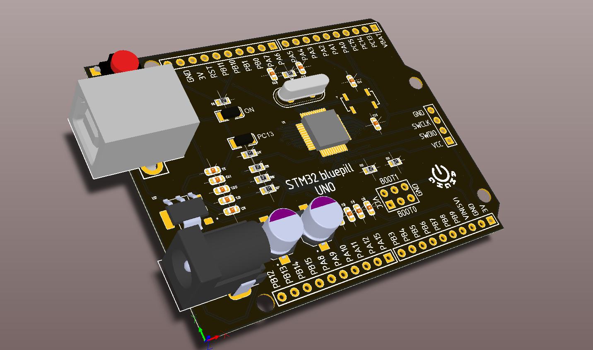
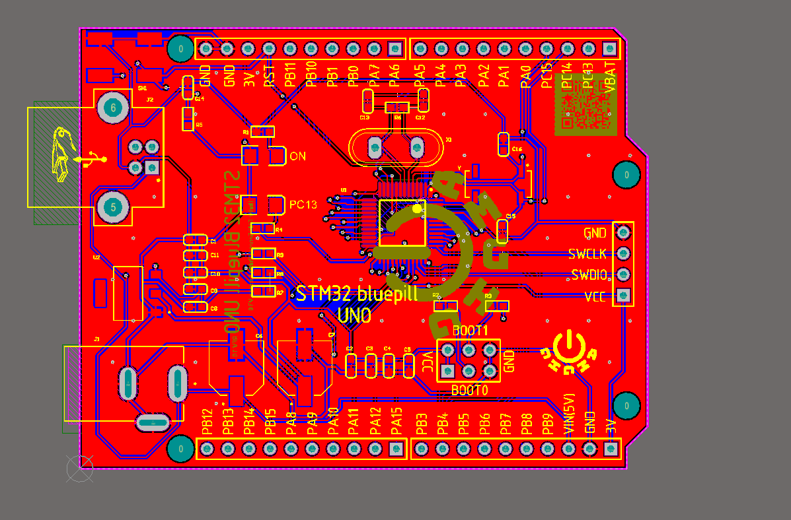
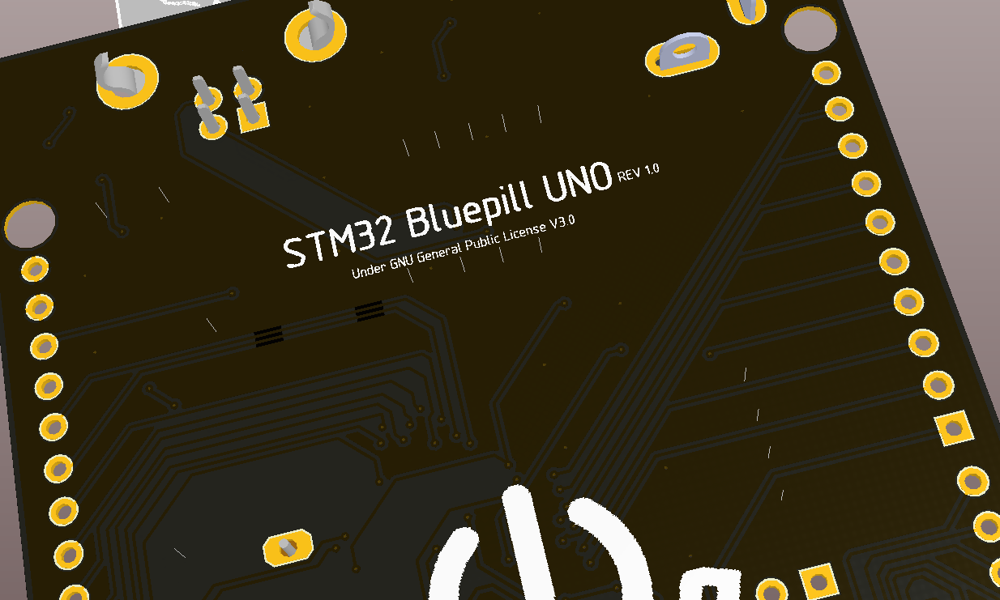

# STM32-BluePill-UNO
A revision of bluepill (STM32F103C8T6 MCU) in the arduino uno shape

# IMPORTANT

**this is just a little fun design i have done on a weekend so i have no intentions of printing it** 

**therefore its not tested and may not work at all**

**so if you want it, make and use it at your own risk**

### if you ever made it and found an error in it please e-mail me or open an issue
# images

